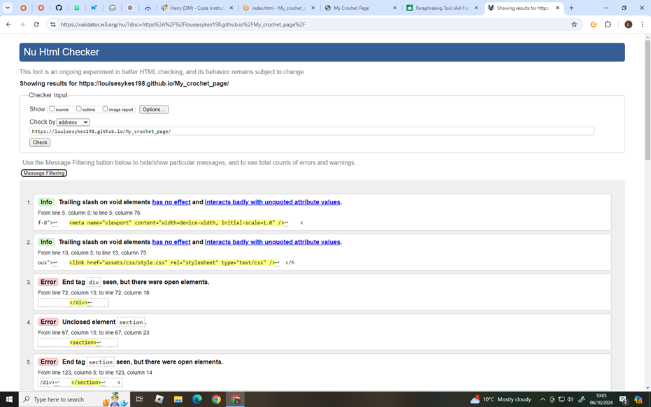

## User Experience (UX)

-   ### User stories

    -   #### First Time Visitor Goals

        1. As an unfamiliar viewer, I want to quickly figure out the site's primary goal and discover more about the company.
        2. I want to be able to find material on the website with ease as a first-time visitor.
        3. I want to be able to mover around the site quickly and be able to get back to where I started. 

    -   #### Returning Visitor Goals

        1. As a Returning Visitor, I would like to know how to contact the organisation with any questions that I might have.
        2. As a Returning Visitor, I want to be able to find and use the socail media links
        3. As a Returning Visitor, I want to be able to find the information I am searching for.

    -   #### Frequent User Goals
        1. As a Frequent User, I want to see if there are any new information has been updated or added.
        2. As a Frequent User, I want to check if any site issues I might of had in the past have been corrected.
        3. As a Frequent User, I want to any questions I may have to be answered in a timely manner.

-   ### Design
    -   #### Colour Scheme
        -   The two main colours used are a light blue, and white.
    -   #### Typography
        -   The Nunito Sans font is the main font used throughout the whole website with Sans Serif as the fallback font in case for any reason the font isn't being imported into the site correctly. Nunito Sans is a clean font used and Sans Serif frequently used in programming, so there are both attractive and appropriate.
    -   #### Imagery
           Imagery is crucial. The large background hero image is intended to be stunning and draw the user's attention. It also has a trendy and vibrant look.

*   ### Wireframes

    -   Desktop Wireframe - [View](https://wireframepro.mockflow.com/editor.jsp?editor=off&perm=Owner&projectid=M74L8w1RTh&publicid=91697f7043554f8eb4dd6c33c11f3038&space=ce16c8809ceb42f3af9a9e5154b3aabd#/page/c9ec330abf5a472ba4b1836009c9b01c/mode/design)

    -   Mobile Wireframe - [View](https://wireframepro.mockflow.com/editor.jsp?editor=off&perm=Owner&projectid=M74L8w1RTh&publicid=91697f7043554f8eb4dd6c33c11f3038&space=ce16c8809ceb42f3af9a9e5154b3aabd#/page/Db889ae22799549a29dbf8a6036ac84fb/mode/design)

    -   Tablet and Ipad Wireframe - [View](https://wireframepro.mockflow.com/editor.jsp?editor=off&perm=Owner&projectid=M74L8w1RTh&publicid=9199335371b54ed3bb30435c6a739c4e&space=ce16c8809ceb42f3af9a9e5154b3aabd#/page/De59d1a70e49d2a039f450db264f64023/mode/design)

## Features

-   Responsive on all device sizes

-   Interactive elements

## Technologies Used

### Languages Used

-   [HTML5](https://en.wikipedia.org/wiki/HTML5)
-   [CSS3](https://en.wikipedia.org/wiki/Cascading_Style_Sheets)

### Frameworks, Libraries & Programs Used

1. [Bootstrap 4.4.1:](https://getbootstrap.com/docs/4.4/getting-started/introduction/)
    - Bootstrap was used to assist with the responsiveness and styling of the website.
1. [Hover.css:](https://ianlunn.github.io/Hover/)
    - Hover.css was used on the Social Media icons in the footer to add the float transition while being hovered over.
1. [Google Fonts:](https://fonts.google.com/)
    - Google fonts were used to import the 'Titillium Web' font into the style.css file which is used on all pages throughout the project.
1. [Font Awesome:](https://fontawesome.com/)
    - Font Awesome was used on all pages throughout the website to add icons for aesthetic and UX purposes.
1. [jQuery:](https://jquery.com/)
    - jQuery came with Bootstrap to make the navbar responsive but was also used for the smooth scroll function in JavaScript.
1. [Git](https://git-scm.com/)
    - Git was used for version control by utilizing the Gitpod terminal to commit to Git and Push to GitHub.
1. [GitHub:](https://github.com/)
    - GitHub is used to store the projects code after being pushed from Git.
1. [Photoshop:](https://www.adobe.com/ie/products/photoshop.html)
    - Photoshop was used to create the logo, resizing images and editing photos for the website.
1. [Mockflow:](https://wireframepro.mockflow.com/))
    - Mockflow was used to create the [wireframes](https://github.com/) during the design process.
  
## Testing

The W3C Markup Validator and W3C CSS Validator Services were used to validate every page of the project to ensure there were no syntax errors in the project.

-   [W3C Markup Validator](https://jigsaw.w3.org/css-validator/#validate_by_input) - [Results](https://github.com/)
[View]()

-   [W3C CSS Validator](https://jigsaw.w3.org/css-validator/#validate_by_input) - [Results](https://github.com/)      

