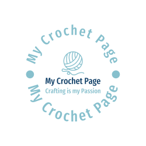
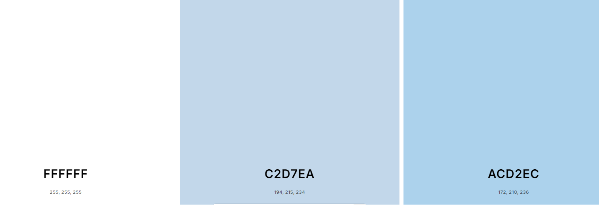
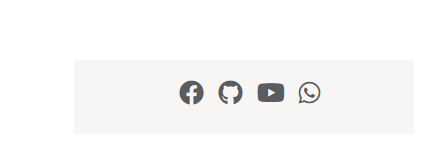
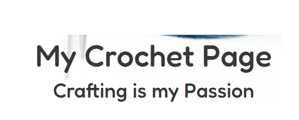
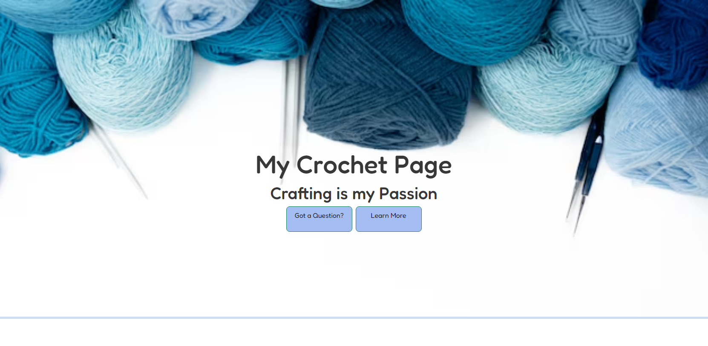

# My Crochet Page

## Description

Learn what you need to get started and where to begin.


[View the live project here.](https://louisesykes198.github.io/My_crochet_page/)
## User Experience (UX)

### User stories

This site is for user who want to start there crochet journey. They can learn where to start and what they need to begin. 

#### First Time Visitor Goals

1. As an unfamiliar viewer, I want to quickly figure out the site's primary goal and discover more about the company.
2. I want to be able to find material on the website with ease as a first-time visitor.
3. I want to be able to mover around the site quickly and be able to get back to where I started

#### Returning Visitor Goals

1. As a Returning Visitor, I would like to know how to contact the organisation with any questions that I might have.
2. As a Returning Visitor, I want to be able to find and use the socail media links
3. As a Returning Visitor, I want to be able to find the information I am searching for.

#### Frequent User Goals

1. As a Frequent User, I want to see if there are any new information has been updated or added.
2. As a Frequent User, I want to check if any site issues I might of had in the past have been corrected.
3. As a Frequent User, I want to any questions I may have to be answered in a timely manner.

### Design

The website, My Crochet Page, presents a clean and minimalist design. Here’s a quick review of the look:

#### Logo
The logo was desgined and downloaded from [Design.com](https://www.design.com/)



#### Colour Scheme
The two main colours used are Code light blue, and light purple.
The colors are simple, with a light blue background (which matches your preference) 
providing a soft, calming effect. This complements a crochet-themed site well.
The text contrasts well with the background, making it easy to read.


    
#### Layout:
The structure is straightforward and user-friendly, with clear sections and no clutter. 
This simplicity keeps the focus on the content.

#### Typography
The Fredoka font is the primary font used throughout the entire website. 
Sans Serif serves as the backup font in the event that the Fredoka font cannot be properly imported into the website. 

All icons were sourced though [Font Awesome](https://fontawesome.com/)



All fonts were sourced through [Google Fonts](https://fonts.google.com/)

The font that I've selected for my website is simple, modern, and extremely readable; it's meant to communicate both professionalism and warmth. 
The headlines' bold, Fredoka font draws attention without being unduly harsh, nicely balancing my hero image's simplicity and clarity. 
The call-to-action and other important places, like my main message, are highlighted by the font's weight.



#### Imagery
The background image serves as a hero image, which is designed to be striking and eye catching to intise user's attention. The image came from [freepik](https://www.freepik.com/)

My website's hero image is intended to draw attention right away with its modern, stylish appearance. 
It has a big picture that captures the core values of my brand, giving it an eye-catching and welcoming appearance. 
A short headline that sums up my message sits in the centre of the image, providing visitors with an instant idea of what they can expect from the website.


### Wireframes

Desktop Wireframe - [View]([assets/images/desk-top-wireframe.png](https://wireframepro.mockflow.com/editor.jsp?editor=off&perm=Owner&projectid=M74L8w1RTh&publicid=f6317e4769e440d18a553e8f44d7a54c&space=ce16c8809ceb42f3af9a9e5154b3aabd#/page/c9ec330abf5a472ba4b1836009c9b01c/mode/design))

Mobile Wireframe - [View]([assets/images/mobile-wireframe.png](https://wireframepro.mockflow.com/editor.jsp?editor=off&perm=Owner&projectid=M74L8w1RTh&publicid=f6317e4769e440d18a553e8f44d7a54c&space=ce16c8809ceb42f3af9a9e5154b3aabd#/page/De59d1a70e49d2a039f450db264f64023/mode/design))

Tablet and Ipad Wireframe - [View]([assets/images/tablet-and-ipad-wireframe.png](https://wireframepro.mockflow.com/editor.jsp?editor=off&perm=Owner&projectid=M74L8w1RTh&publicid=f6317e4769e440d18a553e8f44d7a54c&space=ce16c8809ceb42f3af9a9e5154b3aabd#/page/Db889ae22799549a29dbf8a6036ac84fb/mode/design))


## Features

Responsive on all device sizes

Interactive elements

## Technologies Used

### Languages Used

[HTML5](https://en.wikipedia.org/wiki/HTML5)
[CSS3](https://en.wikipedia.org/wiki/Cascading_Style_Sheets)

### Frameworks, Libraries & Programs Used

1. [Bootstrap 4.4.1:](https://getbootstrap.com/docs/4.4/getting-started/introduction/)
    - Bootstrap was used to assist with the responsiveness and styling of the website.
1. [Hover.css:](https://ianlunn.github.io/Hover/)
    - Hover.css was used on the Social Media icons in the footer to add the float transition while being hovered over.
1. [Google Fonts:](https://fonts.google.com/)
    - Google fonts were used to import the 'Titillium Web' font into the style.css file which is used on all pages throughout the project.
1. [Font Awesome:](https://fontawesome.com/)
    - Font Awesome was used on all pages throughout the website to add icons for aesthetic and UX purposes.
1. [jQuery:](https://jquery.com/)
    - jQuery came with Bootstrap to make the navbar responsive but was also used for the smooth scroll function in JavaScript.
1. [Git](https://git-scm.com/)
    - Git was used for version control by utilizing the Gitpod terminal to commit to Git and Push to GitHub.
1. [GitHub:](https://github.com/)
    - GitHub is used to store the projects code after being pushed from Git.
1. [mockflow:](https://mockflow.com/)
    - mockflow was used to create the [wireframes](https://github.com/) during the design process.

## Testing

The W3C Markup Validator and W3C CSS Validator Services were used to validate every page of the project to ensure there were no syntax errors in the project.

[W3C Markup Validator](https://jigsaw.w3.org/css-validator/#validate_by_input) - [Results](https://github.com/)

[W3C CSS Validator](https://jigsaw.w3.org/css-validator/#validate_by_input) - [Results](https://github.com/)

### Testing User Stories from User Experience (UX) Section
    
#### First Time Visitor Goals

As a First Time Visitor, I want them to easily understand the main purpose of the site and learn more about the organisation.

1. When entering the site, users are greeted with a clean and easy to read navigation bar to go to the page of their choice.
Under the navigation bar there is a background image, text a "ask a question" and "Learn More" call to action button.
2. The main points are made immediately with the background image
3. To find out more about the organisation, the user has two options: either scroll down or click the call to action buttons,
which will take them to the same location.

As a First Time Visitor, I want to be able to easily be able to navigate throughout the site to find content.

1. The navigation bar is clear labled so the user knows which part of the page they will be taken to.
2. Tere is a "Back nto Top " call for action button that appears when you ether scroll or click a navigation button
that will return the user back to the top of the page.
3. On the Contact Me Page, when the user has filled in the require text areas and click on the submit button
it will take them to a page that says "Thank you your question will be answered shortly".

#### Returning Visitor Goals

As a Returning Visitor, I want to find the best way to get in contact with the organisation with any questions I may have.

1. The navigation bar clearly highlights the "Contact Me" Page.
2. Here they can fill out the contact me form on the page with the question they want an answer too. 
3. The footer contains links to the organisations Facebook, github and Whatsapp page as well as youtube link to find helpful videos.
4. No matter which link they click on, it will be open in a new tab to make sure the user can get back to the website.
    
As a Returning Visitor, I want to find the Facebook Group link so that I can join and interact with others in the community.

1. The Facebook Page appears in the footer at the bottom of the page.
Clicking on it will cause the user to open a new tab where they may get additional information.
        
### Further Testing

The Website was tested on Google Chrome, Microsoft Edge and Safari browsers.
The website was viewed on a variety of devices such as Desktop, Laptop, samsung galaxy A12, samsung galaxy s22 & iPhoneSE.
Friends and family members were asked to review the site and documentation to point out any bugs and/or user experience issues.

### Reviews

Gemma Stead (sister) said Webpage works well lots of writen details. I like the overall look.

Lindsey Combs (sister) wrote Overall, the website has a pleasant, simple look with room to add more information and images.

Sarah M (work colleague) said That is amazing.

### Known Bugs

On some mobile devices the "Ask a question?" button the words came out of the box. 

Performance, Accessibility, Best Practice and SEO checked on.
#### Mobile Performance 

#### Desktop Performance 


#### Deployment

### GitHub Pages

The project was deployed to GitHub Pages using the following steps...

1. Log in to GitHub and locate the [GitHub Repository](https://github.com/)
2. At the top of the Repository (not top of page), locate the "Settings" Button on the menu.
    
3. Alternatively Click [Here](https://github.com/louisesykes198/My_crochet_page) for a GIF demonstrating the process starting from Step 2.
3. Scroll down the Settings page until you locate the "GitHub Pages" Section.
4. Under "Source", click the dropdown called "None" and select "Main Branch".
5. The page will automatically refresh.
6. Scroll back down through the page to locate the now published site [link](https://github.com) in the "GitHub Pages" section.

### Forking the GitHub Repository

By forking the GitHub Repository we make a copy of the original repository on our GitHub account to view and/or make changes without affecting the original repository by using the following steps...

1. Log in to GitHub and locate the [GitHub Repository](https://github.com/)
2. At the top of the Repository (not top of page) just above the "Settings" Button on the menu, locate the "Fork" Button.
3. You should now have a copy of the original repository in your GitHub account.

### Making a Local Clone

1. Log in to GitHub and locate the [GitHub Repository](https://github.com/)
2. Under the repository name, click "Clone or download".
3. To clone the repository using HTTPS, under "Clone with HTTPS", copy the link.
4. Open Git Bash
5. Change the current working directory to the location where you want the cloned directory to be made.
6. Type `git clone`, and then paste the URL you copied in Step 3.

```
$ git clone https://github.com/YOUR-USERNAME/YOUR-REPOSITORY
```

7. Press Enter. Your local clone will be created.

```
$ git clone https://github.com/YOUR-USERNAME/YOUR-REPOSITORY
> Cloning into `CI-Clone`...
> remote: Counting objects: 10, done.
> remote: Compressing objects: 100% (8/8), done.
> remove: Total 10 (delta 1), reused 10 (delta 1)
> Unpacking objects: 100% (10/10), done.
```

Click [Here](https://help.github.com/en/github/creating-cloning-and-archiving-repositories/cloning-a-repository#cloning-a-repository-to-github-desktop) to retrieve pictures for some of the buttons and more detailed explanations of the above process.

## Credits

### Code

The full-screen background image code came from this [freepik](https://freepik.com)

[Bootstrap5](https://getbootstrap.com/docs/5.3.3/getting-started/introduction/): Bootstrap Library used throughout the project mainly to make site responsive using the Bootstrap Grid System.

[Back to Top button](https://www.youtube.com/watch?v=SJVCvnKM_lI) : For "Back to Top" button I used this vidoe fron youtube for the tutorial.
### Content

All content was written by the developer.

The learn more page information was created by [chatgpt.com](https://chatgpt.com/)

### Media

All Images were created by the [fontawesome](https://fontawesome.com/)

### Acknowledgements

My Mentor for continuous helpful feedback.

Tutor support at Code Institute for their support.

GTCoding for "Back to Top" button 

Family and Friends for feed back
